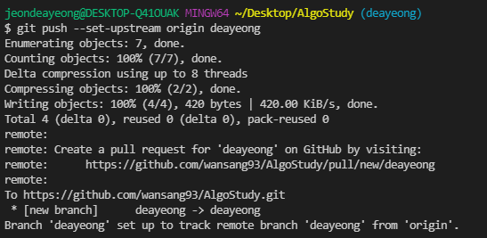

# git branch

---

# 스터디 깃 사용 방법

## 1. clone 받는다.

## 2. 잘 받아졌는지 확인

```bash
git log
# 기존에 있던 로그 확인

git branch -a
# 기존에 있던 branch 확인
```

## 3. branch 생성

```bash
git branch [생성할 이름]
```

## 4. branch 이동

```bash
git checkout [이동할 branch 이름]
```

## 5. 작업한거 add, commit, push 하기

```bash
git add .
git commit -m '[message]'
git push --set-upstream origin [자신의 branch 이름]
```

- 예시

    

## 6. merge 시키기

### 6-1. pull request

New pull request 선택


### 6-2. 자기꺼 branch 선택하기


### 6-3. create pull request

본인꺼 `commit` 확인하고 `pull request` 보내기


### 6-4. merge 하기

이상이 없을시 바로 `merge` 하기

